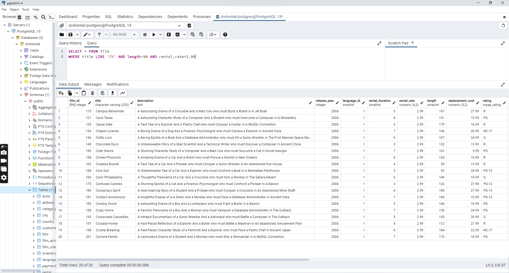

# LIKE ve ILIKE
Aşağıdaki sorgumuzda actor tablomuzda bulunan tüm sütunlardaki verileri first_name sütununda ki değeri 'Penelope' olmak üzere getiriyoruz.
```
SELECT *
FROM actor
WHERE first_name = 'Penelope';
```
Ancak bizler bazı durumlarda bu şekilde tam eşleşme değil belirli şablonlara uyan koşulların sağlanmasını isteriz. Örneğin aşağıdaki sorgumuzda first_name sütunun 'Penelope' değerine eşit olmasını değil, ilk harfin 'P' olması koşulunu sağlar. Bunun için LIKE operatörünü kullanırız.
```
SELECT *
FROM actor
WHERE first_name LIKE 'P%';
```
Burada kullanılan % karakteri sıfır, bir veya daha fazla karakteri temsil eder ve Wildcard olarak isimlendirilir. Bir diğer wildcard karakteri _ karakteridir ve bir karakteri temsil eder.

## LIKE Söz Dizimi
```
SELECT <sütun_adı>, <sütun_adı>, ...
FROM <tablo_adı>
WHERE <sütun_adı> LIKE <şablon>;
```
ILIKE operatörü LIKE operatörünün case - insensitive versiyonudur.
~~ LIKE ~~* ILIKE anlamına gelir NOT için ifadelerin başında ! kullanılır 


